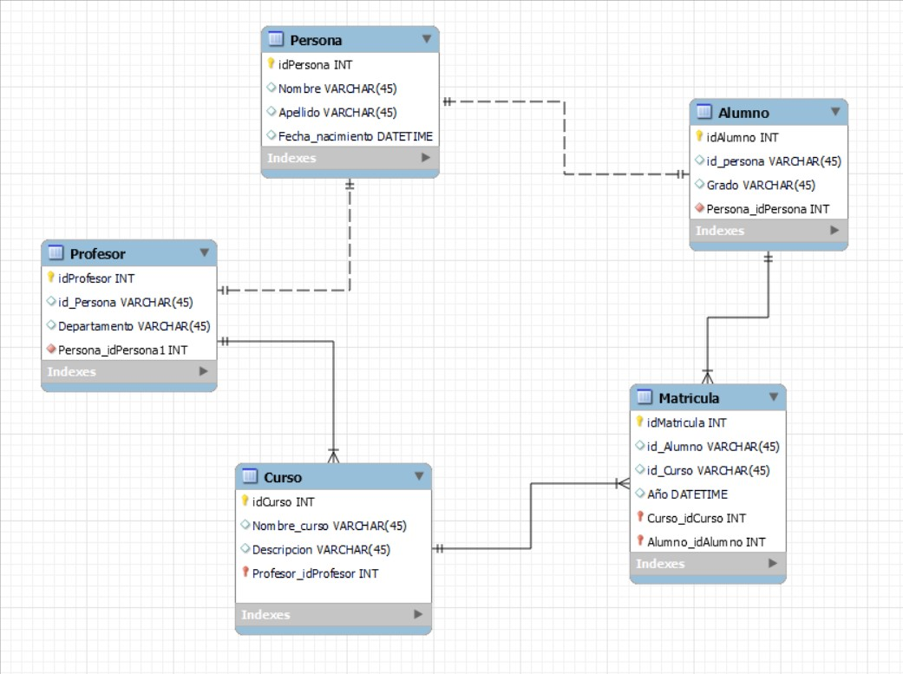

# Normalización 

# Introducción
Este repositorio contiene informacion sobre normalización de diagramas relacionales.

# Actividad 
Convertir un modelo ER en un modelo relacional.
+ Gererar Codigo DDL asociado.
+  Verificar la Tercera forma normal.
+ Verificar la forma normal de Boyce-Codd.

## Respuesta
El siguiente modelo esta basado  en las entidades, Persona, Profesor, Alumno, Curso y Matricula.

# Diagrama de normalización.

## Descripcion
Las entidades en el modelo son las siguientes:

+ Persona: Representa a una persona con atributos como ID_Persona (identificador único), Nombre, Apellido y Fecha_Nacimiento.
+ Alumno: Representa a un alumno con atributos como ID_Alumno (identificador único), ID_Persona (clave foránea para la tabla Persona) y Grado.
+ Profesor: Representa a un profesor con atributos como ID_Profesor (identificador único), ID_Persona (clave foránea para la tabla Persona) y Departamento.
+ Curso: Representa a un curso con atributos como ID_Curso (identificador único), Nombre_Curso y Descripcion.
+ Matricula: Representa una matrícula de un alumno en un curso, con atributos como ID_Matricula (identificador único), ID_Alumno (clave foránea para la tabla Alumno), ID_Curso (clave foránea para la tabla Curso) y Año.

**1FN (Primera Forma Normal)**

 ### Tabla Persona.

| ID_Persona | Nombre | Apellido | Fecha_Nacimiento |
|------------|--------|----------|------------------|
| 1          | Ana    | Perez    | 1990-01-20       |
| 2          | Juan   | Lopez    | 1992-04-15       |
| 3          | Maria  | Garcia   | 1978-08-24       |
| 4          | Luis   | Rodriguez| 1980-07-12       |

 ### Tabla Alumno.
 
 | ID_Alumno | ID_Persona | Grado |
|-----------|------------|-------|
| 1         | 1          | 10    |
| 2         | 2          | 9     |

### Tabla Matricula

| ID_Matricula | ID_Alumno | ID_Curso | Año |
|--------------|-----------|----------|-----|
| 1            | 1         | 1        | 2023|
| 2            | 1         | 2        | 2023|
| 3            | 2         | 1        | 2023|

### Tabla Profesor

| ID_Profesor | ID_Persona | Departamento |
|-------------|------------|--------------|
| 1           | 3          | Matemáticas  |
| 2           | 4          | Literatura   |

### Tabla Curso 
| ID_Curso | Nombre_Curso | Descripcion |
|----------|--------------|-------------|
| 1        | Matemáticas  | Curso de matemáticas avanzadas |
| 2        | Literatura   | Curso de literatura contemporánea |

+ Primera Forma Normal (1NF):
Las tablas cumplen con la 1NF ya que todos los datos están organizados en tablas y cada celda contiene un solo valor atómico. Además, se identifican claves primarias en cada tabla para garantizar la unicidad de los registros.

+ Segunda Forma Normal (2NF):
Las tablas cumplen con la 2NF ya que no existe dependencia parcial en ninguna de ellas. Los atributos en cada tabla dependen completamente de las claves primarias respectivas. Por ejemplo, en la tabla Matricula, todos los atributos dependen directamente de la clave primaria compuesta (ID_Matricula, ID_Alumno, ID_Curso).

+ Tercera Forma Normal (3NF):
Las tablas también cumplen con la 3NF ya que no existen dependencias transitivas entre los atributos. Cada atributo depende directamente de la clave primaria correspondiente. Por ejemplo, en la tabla Alumno, el atributo Grado depende directamente de la clave primaria ID_Alumno.

+ Boyce-Codd Normal Form (BCNF):
Según la estructura de las tablas, también cumplen con la forma normal de Boyce-Codd (BCNF). Esto significa que no hay dependencias funcionales no triviales en las tablas que no estén determinadas por las claves primarias. Cada atributo no clave depende completamente de las claves primarias correspondientes.

>No existen dependencias parciales ni transitivas en los datos. 
 El modelo de datos ya cumple con todas estas formas normales.

